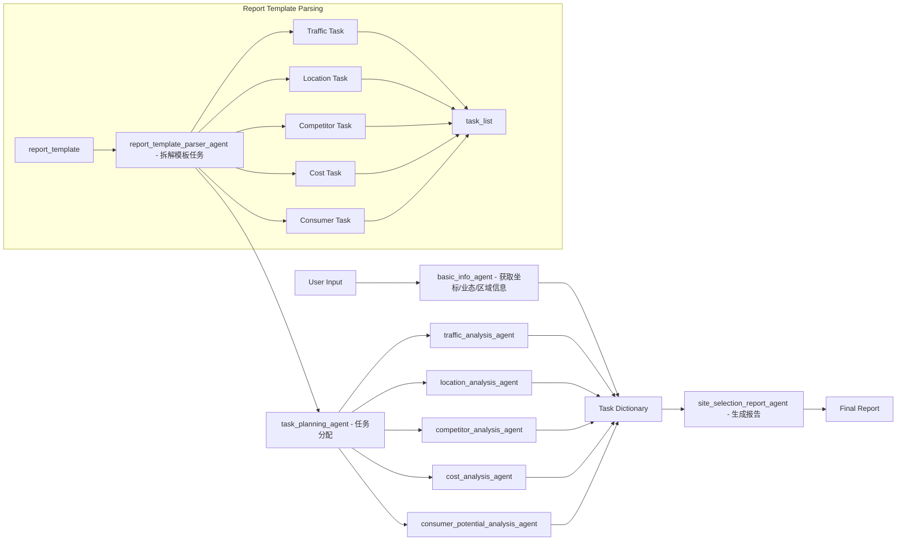

## File List:
- main.py - main script
- agent_configs.yaml - settings for creating different agent
- agent_loader.py - function for creating agent entity
- tools.py - tools for agent use
- info_tools.py - tools for agents to communicate with each other through MySQL (Other information list function also can be used, MySQL is just a temporary solution)
- db.py - settings for connecting MySQL
- report_template.py - store report template
- md_html.py - convert report from markdown format string to HTML file.

## Overall Framework:

Agent List:
| Agent Name                       | Report Section              | Task Description                                                                 | Required GIS Functionalities                                                      | Tools / Modules (Planned)                                    | Status       |
|----------------------------------|-----------------------------|----------------------------------------------------------------------------------|------------------------------------------------------------------------------------|--------------------------------------------------------------|--------------|
| basic_info_agent                 | Site Overview               | Collect coordinates, land use, region, POI category, commercial format, date     | - Geocoding (address → coordinates)                                               |
- Spatial join to land use/region polygon
- POI category mapping                | - geocode_address
- PostGIS polygon intersect
- POI category dictionary             | Done         |
| traffic_analysis_agent           | Traffic Analysis            | Count nearby MRT & bus stops
Calculate distance to nearest station
Estimate walking time               | - Buffer-based POI count
- Nearest neighbor analysis
- Distance-to-time estimation       | - PostGIS ST_Buffer, ST_Distance
- Walking time estimation model     | Done         |
| location_analysis_agent          | Location Analysis           | Identify district function
Evaluate commercial suitability
Analyze surrounding land use       | - Regional polygon match
- Overlay with zoning layer
- Functional zone extraction        | - Land use shapefile
- Planning attribute overlay        | unfinished   |
| competitor_analysis_agent        | Competitor Analysis         | Count nearby competitors
List main brands
Evaluate market density            | - POI clustering
- Distance-based ranking
- Spatial density heatmap          | - ST_DWithin
- Brand category classifier         | unfinished   |
| cost_analysis_agent              | Cost Analysis               | Retrieve rental data
Calculate average rent
(Optional: generate rent heatmap) | - Spatial join with rental database
- Historical trend mapping         | - Rental database
- Raster or zonal rent grid        | unfinished   |
| consumer_potential_analysis_agent | Consumer Potential Analysis | Retrieve population and housing data
Estimate consumption power         | - Population/housing spatial distribution
- Zonal income modeling            | - Population raster or zones
- Price data + income model        | unfinished   |
| site_selection_report_agent      | Report Generation           | Generate full report (Markdown/HTML)                                            | None                                                                               | - Markdown formatter
- HTML converter                   | Done         |

