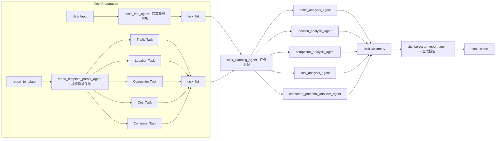

## File List:
- main.py - main script
- agent_configs.yaml - settings for creating different agent
- agent_loader.py - function for creating agent entity
- tools.py - tools for agent use
- info_tools.py - tools for agents to communicate with each other through MySQL (Other information list function also can be used, MySQL is just a temporary solution)
- db.py - settings for connecting MySQL
- report_template.py - store report template
- md_html.py - convert report from markdown format string to HTML file.

## Overall Framework:

## Agent List:
| Agent Name                        | Report Section              | Task Description                                                             | Required GIS Functionalities                                                    | Tools / Modules (Planned)                                       | Web Search | City-wide Comparison | Status       |
|----------------------------------|-----------------------------|------------------------------------------------------------------------------|----------------------------------------------------------------------------------|------------------------------------------------------------------|------------|-----------------------|--------------|
| basic_info_agent                 | Site Overview               | Collect coordinates, land use, region, POI category, commercial format, date | Geocoding, spatial join to land use/region, POI category mapping                | geocode_address, PostGIS polygon intersect, POI category mapping | No         | No                    | Done         |
| report_template_parser_agent     | N/A                         | Parse the report template into detailed tasks                                | None                                                                            | Template parser                                                  | No         | No                    | Done         |
| task_planning_agent              | N/A                         | Assign parsed tasks to appropriate agents based on capabilities              | None                                                                            | Task router, agent registry                                      | No         | No                    | Done         |
| traffic_analysis_agent           | Traffic Analysis            | Count nearby MRT/bus stops, distance to station, estimate walk time          | Buffer zone POI count, distance analysis                                        | PostGIS ST_Buffer, ST_Distance, walking time model               | No         | ✅ Yes                | unfinished         |
| location_analysis_agent          | Location Analysis           | Identify district function, analyze zoning & commercial suitability          | Regional matching, land use overlay                                             | Zoning shapefile, policy map                                     | ✅ Yes      | ✅ Yes                | unfinished   |
| competitor_analysis_agent        | Competitor Analysis         | Count competitors, list brands, evaluate density & heatmap                   | POI clustering, distance to competitors, brand presence density                 | ST_DWithin, POI category filter, spatial heatmap                 | ✅ Yes      | ✅ Yes                | unfinished   |
| cost_analysis_agent              | Cost Analysis               | Retrieve rent data, calculate avg rent, generate rental insights             | Spatial join with rent DB, trend chart, optional rent web scrape                | Rental database, market site parsing                             | ✅ Yes      | ✅ Yes                | unfinished   |
| consumer_potential_analysis_agent | Consumer Potential Analysis | Population & housing analysis, estimate spending power                       | Spatial population mapping, price zone matching, online consumer behavior       | Population raster, price layer, income zone model                | ✅ Yes      | ✅ Yes                | unfinished   |
| site_selection_report_agent      | Report Generation           | Compile and generate full Markdown/HTML report                               | None                                                                            | Markdown formatter, HTML converter                              | No         | No                    | Done         |

