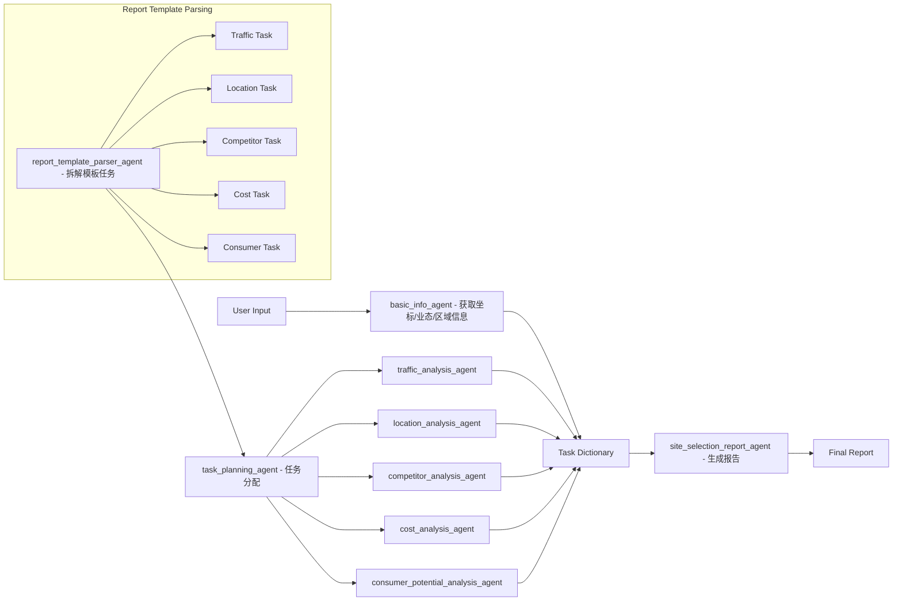

## File List:
- main.py - main script
- agent_configs.yaml - settings for creating different agent
- agent_loader.py - function for creating agent entity
- tools.py - tools for agent use
- info_tools.py - tools for agents to communicate with each other through MySQL (Other information list function also can be used, MySQL is just a temporary solution)
- db.py - settings for connecting MySQL
- report_template.py - store report template
- md_html.py - convert report from markdown format string to HTML file.

## Overall Framework:

Agent List:

